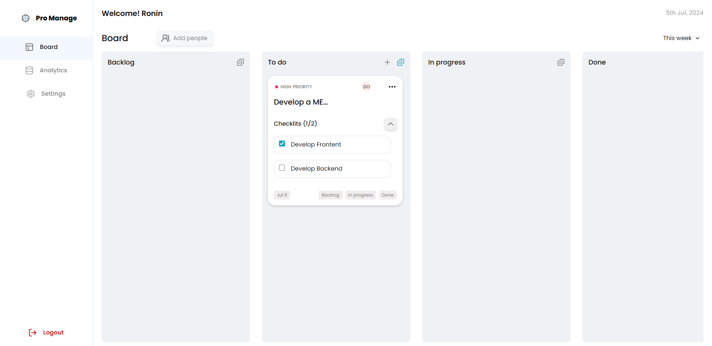

# Pro-Manage

A task-management application built on the MERN stack. Pro-Manage gives a
single user a Kanban board with four columns, per-task checklists, priorities,
due dates, assignable board members, shareable read-only task links, and a
small analytics dashboard.



---

## Contents

- [Features](#features)
- [Architecture](#architecture)
- [Folder structure](#folder-structure)
- [Local setup](#local-setup)
- [Environment variables](#environment-variables)
- [Development](#development)
- [Testing](#testing)
- [API reference](#api-reference)
- [Security](#security)
- [Deployment](#deployment)
- [Migrations](#migrations)

---

## Features

**Board**
- Four-column Kanban: Backlog, To do, In progress, Done
- Drag a card between columns (mouse, touch or keyboard), or move it from the
  card's own status buttons — the buttons are always available, so the feature
  never depends on a drag gesture
- Client-side search across title, assignee and priority
- Priority and date-range filters, with a clear-filters action
- Per-column task counts and collapse-all for checklists

**Tasks**
- Title, priority (high / moderate / low), due date
- Checklists with per-item completion tracking
- Assign a task to a board member by email
- Public, read-only share links (`/tasks/:taskId`)

**Account**
- Register, log in, log out
- Update name, email and password
- Analytics dashboard: totals, status breakdown, priority breakdown, overdue

**Throughout**
- Responsive from 320px to large desktop
- Loading, empty, error and offline states on every data-backed screen
- Optimistic board updates that roll back when the server rejects them

---

## Architecture

```
┌────────────────────┐     HTTPS / JSON     ┌────────────────────┐
│  React 18 + Vite   │ ───────────────────► │  Express (Node)    │
│                    │ ◄─────────────────── │                    │
│  React Router      │   Bearer JWT auth    │  JWT + bcrypt      │
│  Context + immer   │                      │  Mongoose ODM      │
│  CSS Modules       │                      │                    │
└────────────────────┘                      └─────────┬──────────┘
                                                      │
                                                      ▼
                                            ┌────────────────────┐
                                            │  MongoDB (Atlas)   │
                                            └────────────────────┘
```

**Client** — React 18 with Vite. Server state lives in two Context providers
(`AuthProvider`, `TaskProvider`); `use-immer` handles immutable updates. All
HTTP goes through one client (`src/services/apiClient.js`) that owns the base
URL, auth header, error parsing and session-expiry handling. Styling is CSS
Modules over a design-token layer defined in `src/index.css`.

**Server** — Express with a controller / model / middleware split. Validation
runs as middleware before controllers, so controllers only ever persist an
allowlisted, already-checked payload. A single global error handler converts
every failure — Mongoose, JWT, body-parser or application — into one JSON
envelope.

### Response shape

Success:

```json
{ "status": "success", "data": { } }
```

Failure:

```json
{
  "status": "fail",
  "message": "Human readable message",
  "errors": { "fieldName": "What is wrong with this field" }
}
```

`errors` is present only for validation failures, and is what the forms use to
attach messages to individual inputs.

---

## Folder structure

```
Pro-Manage/
├── client/
│   ├── src/
│   │   ├── components/
│   │   │   ├── form/          DatePicker, FormInput, SearchableDropdown
│   │   │   └── ui/            Button, Modal, Badge, Avatar, States, …
│   │   ├── constants/         Task vocabulary shared across screens
│   │   ├── hooks/             useApiResource, useModal
│   │   ├── pages/
│   │   │   ├── Admin/         App shell, Board, Analytics, Settings
│   │   │   ├── Auth/          Login, Register
│   │   │   └── Public/        Read-only shared task page
│   │   ├── services/          apiClient + endpoint definitions
│   │   ├── store/             AuthProvider, TaskProvider
│   │   ├── utils/             Date formatting, share-link copying
│   │   └── index.css          Design tokens + global reset
│   └── tests/                 Vitest + React Testing Library
│
└── server/
    ├── controllers/           auth, task, user, assignee, error
    ├── middleware/            validate, rateLimit, cors
    ├── model/                 userModel, taskModel, assigneeModel
    ├── routes/                Route definitions + middleware wiring
    ├── scripts/               One-off data migrations
    ├── tests/                 Jest + Supertest (in-memory MongoDB)
    ├── constants.js           Shared domain vocabulary
    ├── app.js                 Express app (no listener — importable by tests)
    └── server.js              DB connection + HTTP listener
```

---

## Local setup

**Prerequisites:** Node.js 18+, npm, and a MongoDB instance (local `mongod` or
a MongoDB Atlas cluster).

```bash
git clone <your-fork-url>
cd Pro-Manage

# 1. Server
cd server
npm install
cp .env.example .env        # then edit .env — see below
npm run dev                 # http://localhost:3003

# 2. Client (in a second terminal)
cd ../client
npm install
cp .env.example .env        # VITE_API_URL=http://localhost:3003
npm run dev                 # http://localhost:5173
```

---

## Environment variables

`.env` files are gitignored. `.env.example` files are committed and contain
placeholders only — never real credentials.

### `server/.env`

| Variable | Required | Example | Purpose |
| --- | --- | --- | --- |
| `MONGODB_URI` | yes | `mongodb://127.0.0.1:27017/pro-manage` | Database connection string |
| `JWT_SECRET_KEY` | yes | *(48 random bytes, hex)* | Signs and verifies JWTs |
| `JWT_EXPIRES_IN` | no | `7d` | Token lifetime (default `7d`) |
| `NODE_ENV` | no | `development` | `development` \| `production` \| `test` |
| `PORT` | no | `3003` | HTTP port (default `3003`) |
| `CLIENT_URL` | yes in prod | `https://pro-manage.vercel.app` | Comma-separated CORS allowlist |

Generate a secret with:

```bash
node -e "console.log(require('crypto').randomBytes(48).toString('hex'))"
```

### `client/.env`

| Variable | Required | Example | Purpose |
| --- | --- | --- | --- |
| `VITE_API_URL` | yes | `http://localhost:3003` | API base URL, no trailing slash |

Everything in a `VITE_`-prefixed variable is compiled into the browser bundle.
Never put a secret there.

---

## Development

| Location | Command | What it does |
| --- | --- | --- |
| `client` | `npm run dev` | Vite dev server on :5173 |
| `client` | `npm run build` | Production build to `dist/` |
| `client` | `npm run preview` | Serve the production build locally |
| `client` | `npm run lint` | ESLint, zero-warning policy |
| `server` | `npm run dev` | API with `NODE_ENV=development` |
| `server` | `npm start` | API using ambient `NODE_ENV` |
| `server` | `npm run start:prod` | API with `NODE_ENV=production` |

Scripts use `cross-env` rather than `SET NODE_ENV=…`, so they behave the same
on Linux, macOS and Windows.

---

## Testing

```bash
cd server && npm test     # Jest + Supertest
cd client && npm test     # Vitest + React Testing Library
```

Backend tests run against an in-memory MongoDB (`mongodb-memory-server`), so
no live database is touched and no fixtures leak between cases. They cover
registration and login, credential-leak regressions, JWT handling, ownership
(IDOR), mass assignment, NoSQL injection, input validation, rate limiting, the
date-range behaviour, and analytics correctness.

Frontend tests cover the API client's error and session handling, the
optimistic-update rollback path, rendering of unassigned tasks, modal focus
management, and the board's drag-and-drop layer — including the guarantee that
the status buttons remain a working, keyboard-accessible fallback.

---

## API reference

Base path: `/api/v1`. All authenticated routes expect
`Authorization: Bearer <token>`.

### Auth

| Method | Path | Auth | Body | Returns |
| --- | --- | --- | --- | --- |
| `POST` | `/auth/register` | – | `name, email, password, confirmPassword` | `201` `{ info, token }` |
| `POST` | `/auth/login` | – | `email, password` | `200` `{ info, token }` |

Registration signs the user in immediately. Neither endpoint ever returns a
password or a password hash.

### Tasks

| Method | Path | Auth | Notes |
| --- | --- | --- | --- |
| `GET` | `/tasks` | yes | Query: `range` (`all\|today\|week\|month`), `status`, `priority`, `page`, `limit` |
| `POST` | `/tasks` | yes | `title, priority, checklists[, status, dueDate, assignee]` |
| `GET` | `/tasks/analytics` | yes | Aggregated counts |
| `GET` | `/tasks/:taskId` | **no** | Public share view — returns a reduced projection |
| `PATCH` | `/tasks/:taskId` | yes | Partial update, allowlisted fields only |
| `DELETE` | `/tasks/:taskId` | yes | `204` |

`range` narrows **completed** tasks only. Unfinished work always stays on the
board regardless of the filter, so changing a filter can never make a user
believe their tasks were deleted.

### Users

| Method | Path | Auth | Notes |
| --- | --- | --- | --- |
| `GET` | `/users` | yes | Current user's public profile |
| `PATCH` | `/users` | yes | `name`, `email`, and `oldPassword` + `newPassword` |

### Assignees (board members)

| Method | Path | Auth |
| --- | --- | --- |
| `GET` | `/assignees` | yes |
| `POST` | `/assignees` | yes |
| `GET` `PATCH` `DELETE` | `/assignees/:assigneeId` | yes |

### Health

`GET /api/v1/health` → `{ status, data: { uptime } }`

---

## Security

**Authentication.** Stateless JWTs signed with `JWT_SECRET_KEY`, verified on
every protected request. Passwords are hashed with bcrypt (cost 12) and are
never returned by any endpoint. Login answers identically — same status, same
message, and after one deliberate dummy bcrypt comparison, in roughly the same
time — whether the email is unknown or the password is wrong, so the endpoint
cannot be used to enumerate accounts.

**Token storage — a deliberate trade-off.** The JWT is kept in `localStorage`.
This is readable by any JavaScript running on the page, so a successful XSS
would expose it; `HttpOnly` cookies would not have that weakness. The trade
was made for the deployment shape (SPA on Vercel, API on Render — different
registrable domains, which means `SameSite=None` cookies plus a CSRF token
layer) and it is mitigated by:

- React escaping all rendered content by default, with no `dangerouslySetInnerHTML` anywhere in the codebase
- Helmet's security headers on every response
- A short-lived token (`JWT_EXPIRES_IN`, default 7 days) with expiry handled centrally
- Nothing but the token and public profile fields ever written to storage

If you deploy the client and API under one domain, switching to `HttpOnly`
cookies is the stronger option — it requires changing token issuance, the API
client, and adding CSRF protection together.

**Transport and headers.** Helmet sets `X-Content-Type-Options`,
`Referrer-Policy`, HSTS and friends; `X-Powered-By` is removed.

**CORS.** An explicit allowlist built from `CLIENT_URL` rather than a bare
`cors()`. In production only the configured origins are accepted; local dev
ports are additionally allowed outside production.

**Rate limiting.** Login and registration are limited to 10 failed attempts per
IP per 15 minutes (successes do not count against the budget). The rest of the
API has a much looser 1000/15min ceiling so ordinary board use is never
throttled. Both return a clean JSON `429`.

**Input validation.** Every externally controlled value — ids, query
parameters, task fields, checklist items, emails, passwords — is validated in
middleware before it reaches a controller, rather than relying on Mongoose
casting. A malformed ObjectId returns a structured `400`, never a crash.

**Mass assignment.** Controllers persist `req.validated`, an allowlisted object
built by the validation layer. Request bodies are never spread into a document
or an update, so `createdBy`, `assignedTo`, `shared`, `_id` and `createdAt`
cannot be set by a client. Ownership always comes from the session.

**Ownership.** Every task query is scoped to
`createdBy === me || assignedTo === me`. Attempting to reach someone else's
task returns `404`, not `403`, so the API does not confirm that it exists.

**Injection.** `express-mongo-sanitize` strips `$`-prefixed and dotted keys, so
a body such as `{ "email": { "$gt": "" } }` cannot turn a lookup into an
operator query.

**Error handling.** Stack traces, file paths and driver messages are returned
in development only. Production emits a generic message for anything
non-operational and logs the detail server-side.

**Request size.** Bodies are capped at 100kb.

---

## Deployment

### MongoDB Atlas
1. Create a cluster and a database user.
2. Allowlist your server's egress IPs (or `0.0.0.0/0` for a hobby deployment).
3. Copy the connection string into `MONGODB_URI`.

### Server — Render
- **Root directory:** `server`
- **Build command:** `npm install`
- **Start command:** `npm start`
- **Environment:** `MONGODB_URI`, `JWT_SECRET_KEY`, `JWT_EXPIRES_IN`,
  `NODE_ENV=production`, `CLIENT_URL=https://<your-app>.vercel.app`

`CLIENT_URL` must match the deployed frontend origin exactly, with no trailing
slash, or CORS will reject the browser.

### Client — Vercel
- **Root directory:** `client`
- **Build command:** `npm run build`
- **Output directory:** `dist`
- **Environment:** `VITE_API_URL=https://<your-api>.onrender.com`

`client/vercel.json` rewrites unknown paths to `index.html` so deep links such
as `/tasks/:id` and `/settings` resolve on a full page load.

Vite inlines `VITE_*` variables at build time, so changing `VITE_API_URL`
requires a redeploy, not just a restart.

---

## Migrations

Earlier versions stored a `shared` boolean on tasks alongside `assignee` and
`assignedTo`; the three could disagree. `shared` is now derived from
`assignedTo`, and `completedAt` was added.

Run once against an existing database:

```bash
cd server
node scripts/migrate-task-assignment.js --dry-run   # report only
node scripts/migrate-task-assignment.js             # apply
```

The script re-resolves `assignedTo` from `assignee`, backfills `completedAt`
for tasks already in Done, removes the stale `shared` field, and syncs indexes.
It is idempotent and deletes nothing. A fresh database does not need it.

---

## Licence

ISC
